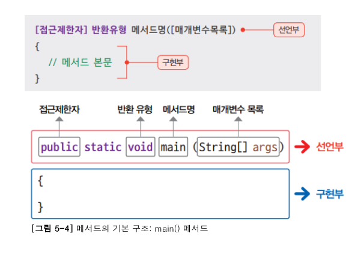
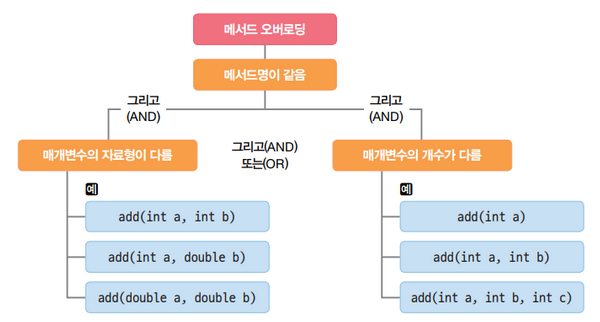
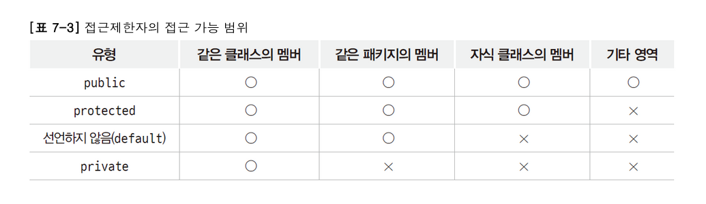

# Additional Explanation

### escape 문자
+ '\n' : 다음칸 맨 앞으로 이동
+ '\r' : 다음칸으로 이동
+ '\t' : tab키와 같은 기능
+ '\b' : 백스페이스키와 같은 기능
+ '\f' : 출력시 페이지넘김 역할을 하는 form feed

### 형식 지정자
| 형식 지정자 |         데이터 타입         | 출력 형식                                                                        |
|:------:|:----------------------:|------------------------------------------------------------------------------|
|   %d   | byte, short, int, long | 부호가 있는 10진수 정수 출력                                                            |
| %X, %x |          int           | 16진수를 출력(양수만 가능), 대문자 X의 경우 16진수 알파벳을 대문자로 표시                                |
|   %o   |          int           | 양수의 8진수를 출력(양수만 가능)                                                          |
|   %c   |          char          | 한 개의 문자 출력                                                                   |
|   %f   |         double         | 고정 소수점 실수 출력                                                                 |
| %E, %e |         double         | 부동 소수점 실수 출력, 대문자 E의 경우 지수 문자로 'E' 사용                                        |
| %G, %g |         double         | 소수점 이하 자릿수가 고정 또는 부동 소수점으로 출력, 자리수가 짧은 것을 기준으로 선택함, 대문자 G의 경우 지수 문자로 'E'를 사용 |
|   %s   |         String         | 문자열 출력                                                                       |
|   %%   |                        | % 출력                                                                         |

### 객체지향 프로그래밍

### 초기화
- 생성자의 용도는 객체의 초기화 목적
- 초기화는 프로그램에서 객체를 사용하기 전에 필요한 값을 보장
- 만약 초기화를 하지 않으면 객체의 속성이나 필드에는 아무 값도 없을 수 있음
- 이 경우, 객체를 사용할 때 예기치 않은 오류가 발생할 수 있음

### static 변수
- 지역 변수의 특성과 전역 변수의 특성을 합친 변수
- 특정 함수에만 사용 가능하면서도 함수가 끝나더라도 값이 그래도 유지됨
- 따라서 프로그램이 끝날 때까지 변수 안의 값이 유지됨
- 모든 전역 변수들은 정적 변수라고 할 수 있음
- 컴파일 시간에 데이터 영역에 메모리를 할당하여 저장되며 프로그램이 끝나면 자동 삭제됨

### 추상화
- 추상화는 클래스들의 공통적인 요소를 뽑아서 상위 클래스를 만들어내는 것
- 반드시 상위 클래스일 필요는 없어서, 공통적인 속성과 기능을 정의한 하위 클래스를 생성할 수도 있음

### 메서드

- 다른 프로그래밍 언어에는 함수라는 것이 별도로 존재하지만 자바는 클래스를 떠나 존재하는 것은 있을 수 없음
- 자바의 함수는 따로 존재하지 않고 클래스 내에 존재 
- 자바는 이러한 클래스 내의 함수를 메서드라고 부름
- 프로그램에서 특정 작업을 수행하기 위한 코드의 집합

### 메서드 오버로딩

- 주의할 점은 '리턴 값만' 다른 것은 오버로딩을 할 수 없다는 것

### 메서드 오버라이딩
- 오버라이딩(overriding)이란 상속 관계에 있는 부모 클래스에서 이미 정의된 메소드를 자식 클래스에서 같은 시그니쳐를 갖는 메소드로 다시 정의하는 것
- Indicates that a method declaration is intended to override a method declaration in a supertype. If a method is annotated with this annotation type compilers are required to generate an error message unless at least one of the following conditions hold:
- The method does override or implement a method declared in a supertype.
- The method has a signature that is override-equivalent to that of any public method declared in Object.

### 인터페이스
- 서로 다른 두 시스템, 장치, 소프트웨어 따위를 서로 이어주는 부분 또는 그런 접속 장치
- 객체 지향적 설계에 있어서 인터페이스는 어떤 객체의 역할만을 정의하여 객체들 간의 관계를 보다 유연하게 연결하는 역할을 담당
- 추상 메서드나 상수를 통해서 어떤 객체가 수행해야 하는 핵심적인 역할만을 규정해두고, 실제적인 구현은 해당 인터페이스를 구현하는 각각의 객체들에서 하도록 프로그램을 설계하는 것을 의미

### 생성자
- new 연산자를 통해서 인스턴스를 생성할 때 반드시 호출이 되고 제일 먼저 실행되는 일종의 메소드(but 메소드와는 다름)
- 생성자는 인스턴스 변수(필드 값 등)를 초기화 시키는 역할

### 접근제한자

### J2EE
- J2EE는 자바 기술로 기업환경의 어플리케이션을 만드는데 필요한 스펙들을 모아둔 스펙 집합

### 상속
- (extends) -> 확장으로 보는 것이 더 나을 수도

### 추상 클래스
- 불완전(uncompleted) 클래스라고 봐도 됨
- 중괄호가 없는 클래스
- 자식 클래스가 받아서 반드시 재정의하는 클래스

### DAO
- Data Access Object

### .ready()
- Tells whether this stream is ready to be read. 
- A buffered character stream is ready if the buffer is not empty, or if the underlying character stream is ready.

### PreparedStatement
- SQL문 사용에 있어 Statement 구문은 SQL Injection이라는 취약점을 가지고 있어 사용하길 권장X
- 따라서 이 대안으로 PreparedStatement(pstmt)을 사용

### SQL Injection
- SQL Injection 이란 악의적인 사용자가 보안상의 취약점을 이용하여, 임의의 SQL 문을 주입하고 실행되게 하여 데이터베이스가 비정상적인 동작을 하도록 조작하는 행위
- 인젝션 공격은 OWASP Top10 중 첫 번째에 속해 있으며, 공격이 비교적 쉬운 편이고 공격에 성공할 경우 큰 피해를 입힐 수 있는 공격

### ResultSet
- SELECT문의 결과를 저장하는 객체

### executeQuery(String SQL)
- ResultSet 객체를 반환하는 SQL문의 경우에 사용

### executeUpdate
- INSERT, UPDATE, DELETE 등 (DML), CREATE, DROP 등(DDL)문들을 실행하는데 사용
- 반환값 : int